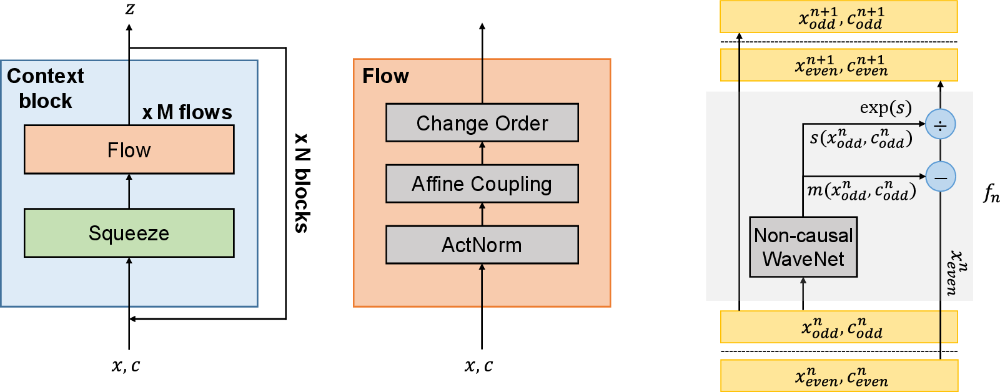

# FloWaveNet : A Generative Flow for Raw Audio 

This is a PyTorch implementation of our work ["FloWaveNet : A Generative Flow for Raw Audio".](https://arxiv.org/abs/1811.02155) (We'll update soon.)

For a purpose of parallel sampling, we propose FloWaveNet, a flow-based generative model for raw audio synthesis.
FloWaveNet can generate audio samples as fast as ClariNet and Parallel WaveNet, while the training procedure is really easy and stable with a single-stage pipeline. Our generated audio samples are available at [https://ksw0306.github.io/flowavenet-demo/](https://ksw0306.github.io/flowavenet-demo/). Also, our implementation of ClariNet (Gaussian WaveNet and Gaussian IAF) is available at [https://github.com/ksw0306/ClariNet](https://github.com/ksw0306/ClariNet)

# Requirements

- PyTorch 0.4.1
- Python 3.6
- Librosa

# Examples

#### Step 1. Download Dataset

- LJSpeech : [https://keithito.com/LJ-Speech-Dataset/](https://keithito.com/LJ-Speech-Dataset/)

#### Step 2. Preprocessing (Preparing Mel Spectrogram)

`python preprocessing.py --in_dir ljspeech --out_dir DATASETS/ljspeech`

#### Step 3. Train

##### Single-GPU training

`python train.py --model_name flowavenet --batch_size 2 --n_block 8 --n_flow 6 --n_layer 2 --block_per_split 4`

##### Multi-GPU training

`python train.py --model_name flowavenet --batch_size 8 --n_block 8 --n_flow 6 --n_layer 2 --block_per_split 4 --num_gpu 4`

NVIDIA TITAN V (12GB VRAM) : batch size 2 per GPU

NVIDIA Tesla V100 (32GB VRAM) : batch size 8 per GPU

#### Step 4. Synthesize

`--load_step CHECKPOINT` : the # of the pre-trained model's global training step (also depicted in the trained weight file)

`--temp`: Temperature (standard deviation) value implemented as z ~ N(0, 1 * TEMPERATURE^2)

ex) `python synthesize.py --model_name flowavenet --n_block 8 --n_flow 6 --n_layer 2 --load_step 100000 --temp 0.8 --num_samples 10 --block_per_split 4`

# Sample Link

Sample Link : [https://ksw0306.github.io/flowavenet-demo/](https://ksw0306.github.io/flowavenet-demo/)

Our implementation of ClariNet (Gaussian WaveNet, Gaussian IAF) : [https://github.com/ksw0306/ClariNet](https://github.com/ksw0306/ClariNet)

- Results 1 : Model Comparisons (WaveNet (MoL, Gaussian), ClariNet and FloWaveNet)

- Results 2 : Temperature effect on Audio Quality Trade-off (Temperature T : 0.0 ~ 1.0, Model : FloWaveNet)

- Results 3 : Analysis of ClariNet Loss Terms (Loss functions : 1. Only KL 2. KL + Frame 3. Only Frame)

- Results 4 : Causality of WaveNet Dilated Convolutions (FloWaveNet : Non-causal WaveNet Affine Coupling Layers, FloWaveNet_causal : Causal WaveNet Affine Coupling Layers)

# Reference

- WaveNet vocoder : [https://github.com/r9y9/wavenet_vocoder](https://github.com/r9y9/wavenet_vocoder)
- glow-pytorch : [https://github.com/rosinality/glow-pytorch](https://github.com/rosinality/glow-pytorch)
